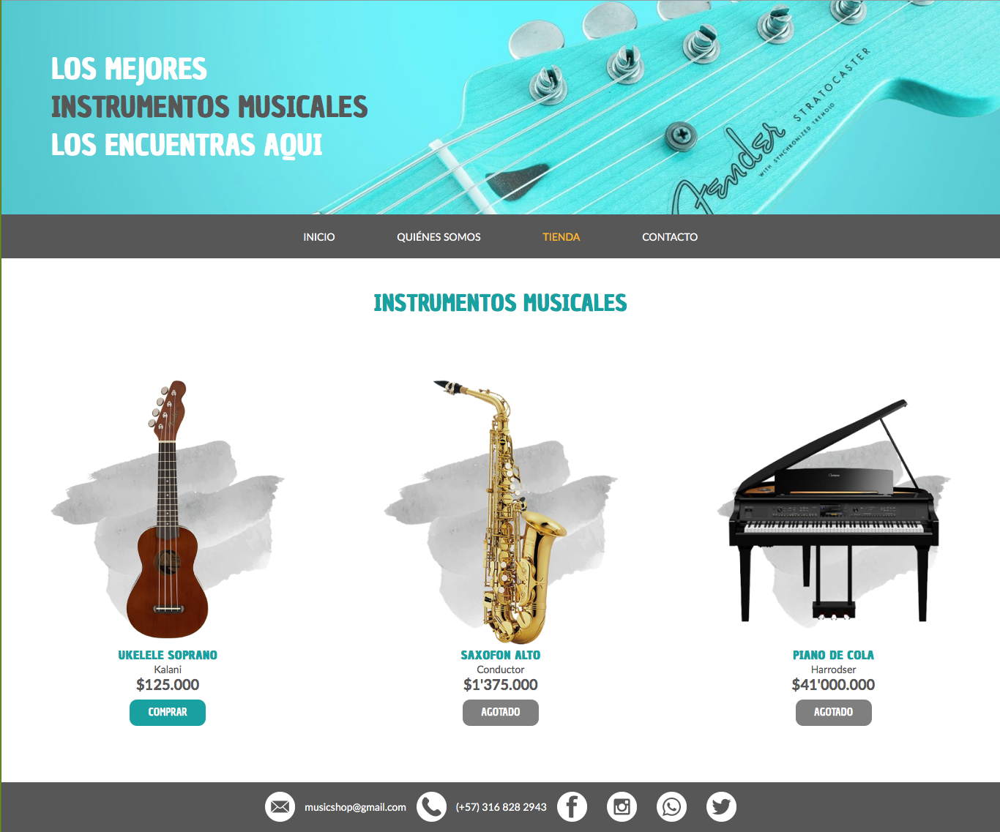
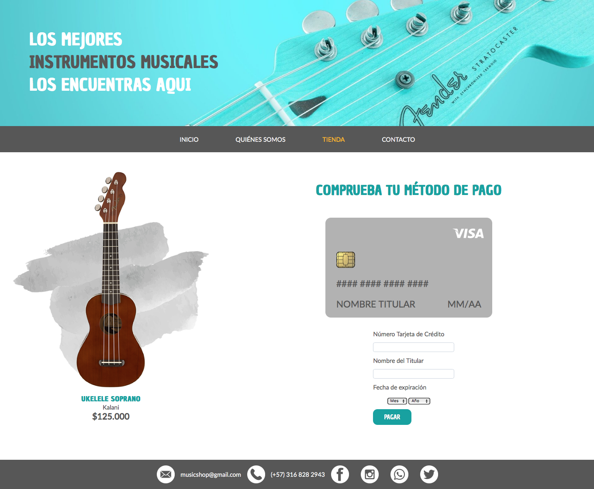
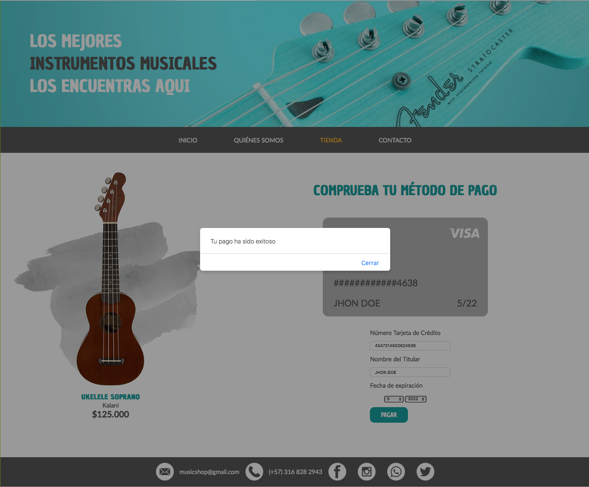
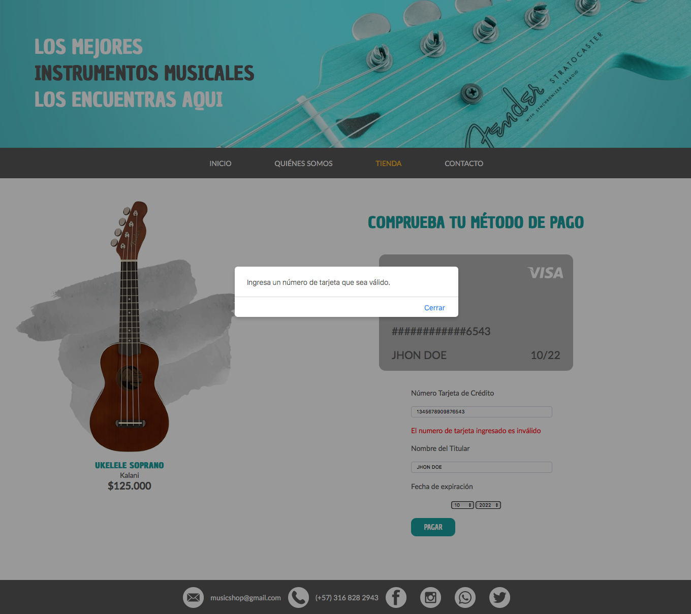
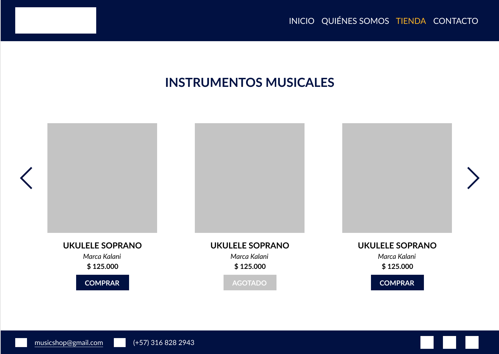
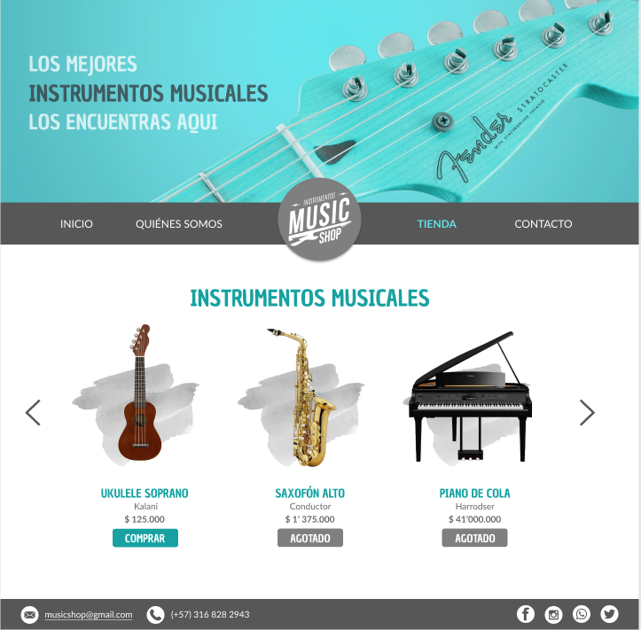
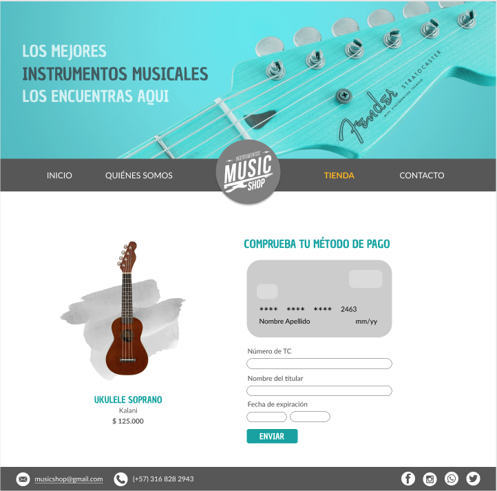

# MUSIC SHOP

## Índice

* [1. Descripción del proyecto](#1-descripción-del-proyecto)
* [2. Investigación UX](#2-investigación-ux)
* [3. Objetivos de aprendizaje](#3-objetivos-de-aprendizaje)

***

## 1. Descripción del proyecto

MUSIC SHOP es una página web musical especializada en la venta de instrumentos musicales.

## 2. Investigación UX

### ¿Quiénes son los principales usuarios del producto?

Los principales usuarios de MUSIC SHOP son músicos profesionales y/o empíricos que busquen adquirir nuevos instrumentos de la más alta calidad. También personas interesadas en iniciar su proceso de aprendizaje en el mundo musical.

### ¿Cuáles son los objetivos de estos usuarios en relación con tu producto?

El principal objetivo de los usuarios es encontrar una plataforma segura en donde adquirir instrumentos de alta calidad y poder comparlos en una tienda online.

### ¿Cómo crees que el producto que estás creando está resolviendo sus problemas?

El producto que creamos facilita una interfaz web que permite a los usuarios visualizar diferentes instrumentos y facilita realizar el pago en línea.

### Prototipo en papel

### Prototipo digital

Mediante el feedback a nuestro prototipo en papel, definimos un nuevo diseño más interactivo y llamativo para el usuario. Se buscó que mediante los colores y reorganización de elementos (como la barra de navegación), se generara un ambiente más amigable.

## 3. Objetivos de aprendizaje

### UX

* [x] Diseñar la aplicación pensando y entendiendo al usuario
* [x] Crear prototipos para obtener feedback e iterar
* [x] Aplicar los principios de diseño visual

### HTML y CSS

* [x] Uso correcto de HTML semántico
* [x] Uso de selectores de CSS
* [x] Construir tu aplicación respetando el diseño realizado (maquetación).

### DOM

* [ ] Uso de selectores de nodos del DOM
* [x] Manejo de eventos del DOM
* [x] Manipulación dinámica del DOM

### Javascript

* [x] Manipulación de strings
* [x] Uso de condicionales
* [x] Uso de bucles
* [x] Uso de funciones
* [ ] Datos atómicos y estructurados
* [ ] Utilizar ES Modules (`import` | `export`).

### Testing

* [ ] [Testeo de tus funciones](https://jestjs.io/docs/es-ES/getting-started)

### Git y GitHub

* [x] Comandos de git (`add` | `commit` | `pull` | `status` | `push`).
* [x] Manejo de repositorios de GitHub (`clone` | `fork` | `gh-pages`).

### Buenas prácticas de desarrollo

* [x] Organizar y dividir el código en módulos (Modularización).
* [x] Uso de identificadores descriptivos (Nomenclatura | Semántica).
* [ ] Uso de linter para seguir buenas prácticas (ESLINT).